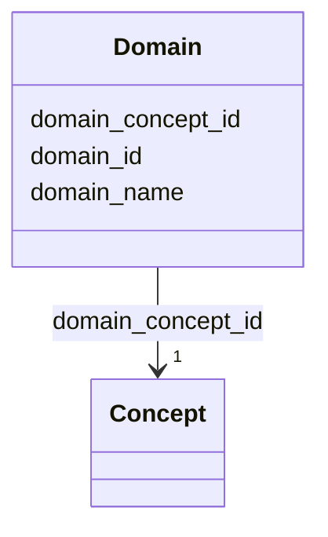

# Class: Domain 


_The DOMAIN table includes a list of OMOP-defined Domains to which the Concepts of the Standardized Vocabularies can belong.  A Domain represents a clinical definition whereby we assign matching Concepts for the standardized fields in the CDM tables.  For example, the Condition Domain contains Concepts that describe a patient condition, and these Concepts can only be used in the condition_concept_id field of the CONDITION_OCCURRENCE and CONDITION_ERA tables.  This reference table is populated with a single record for each Domain, including a Domain ID and a descriptive name for every Domain._


URI: [https://athena.ohdsi.org/search-terms/terms#concept/Domain](https://athena.ohdsi.org/search-terms/terms#concept/Domain)





<!-- no inheritance hierarchy -->


## Slots

| Name | Cardinality and Range | Description | Inheritance |
| ---  | --- | --- | --- |
| [domain_id](domain_id.md) | 1 <br/> [String](String.md) |  | direct |
| [domain_name](domain_name.md) | 1 <br/> [String](String.md) |  | direct |
| [domain_concept_id](domain_concept_id.md) | 1 <br/> [Concept](Concept.md) |  | direct |


## Usages

| used by | used in | type | used |
| ---  | --- | --- | --- |
| [Concept](Concept.md) | [domain_id](domain_id.md) | range | [Domain](Domain.md) |


## Identifier and Mapping Information


### Schema Source


* from schema: https://athena.ohdsi.org/search-terms/terms#concept


## Mappings

| Mapping Type | Mapped Value |
| ---  | ---  |
| self | https://athena.ohdsi.org/search-terms/terms#concept/Domain |
| native | https://athena.ohdsi.org/search-terms/terms#concept/Domain |


## LinkML Source

<!-- TODO: investigate https://stackoverflow.com/questions/37606292/how-to-create-tabbed-code-blocks-in-mkdocs-or-sphinx -->

### Direct

<details>
```yaml
name: Domain
description: The DOMAIN table includes a list of OMOP-defined Domains to which the
  Concepts of the Standardized Vocabularies can belong.  A Domain represents a clinical
  definition whereby we assign matching Concepts for the standardized fields in the
  CDM tables.  For example, the Condition Domain contains Concepts that describe a
  patient condition, and these Concepts can only be used in the condition_concept_id
  field of the CONDITION_OCCURRENCE and CONDITION_ERA tables.  This reference table
  is populated with a single record for each Domain, including a Domain ID and a descriptive
  name for every Domain.
from_schema: https://athena.ohdsi.org/search-terms/terms#concept
attributes:
  domain_id:
    name: domain_id
    from_schema: https://athena.ohdsi.org/search-terms/terms#concept
    identifier: true
    domain_of:
    - Concept
    - Domain
    range: string
    required: true
  domain_name:
    name: domain_name
    from_schema: https://athena.ohdsi.org/search-terms/terms#concept
    rank: 1000
    domain_of:
    - Domain
    range: string
    required: true
  domain_concept_id:
    name: domain_concept_id
    from_schema: https://athena.ohdsi.org/search-terms/terms#concept
    rank: 1000
    domain_of:
    - Domain
    range: Concept
    required: true

```
</details>

### Induced

<details>
```yaml
name: Domain
description: The DOMAIN table includes a list of OMOP-defined Domains to which the
  Concepts of the Standardized Vocabularies can belong.  A Domain represents a clinical
  definition whereby we assign matching Concepts for the standardized fields in the
  CDM tables.  For example, the Condition Domain contains Concepts that describe a
  patient condition, and these Concepts can only be used in the condition_concept_id
  field of the CONDITION_OCCURRENCE and CONDITION_ERA tables.  This reference table
  is populated with a single record for each Domain, including a Domain ID and a descriptive
  name for every Domain.
from_schema: https://athena.ohdsi.org/search-terms/terms#concept
attributes:
  domain_id:
    name: domain_id
    from_schema: https://athena.ohdsi.org/search-terms/terms#concept
    identifier: true
    alias: domain_id
    owner: Domain
    domain_of:
    - Concept
    - Domain
    range: string
    required: true
  domain_name:
    name: domain_name
    from_schema: https://athena.ohdsi.org/search-terms/terms#concept
    rank: 1000
    alias: domain_name
    owner: Domain
    domain_of:
    - Domain
    range: string
    required: true
  domain_concept_id:
    name: domain_concept_id
    from_schema: https://athena.ohdsi.org/search-terms/terms#concept
    rank: 1000
    alias: domain_concept_id
    owner: Domain
    domain_of:
    - Domain
    range: Concept
    required: true

```
</details>